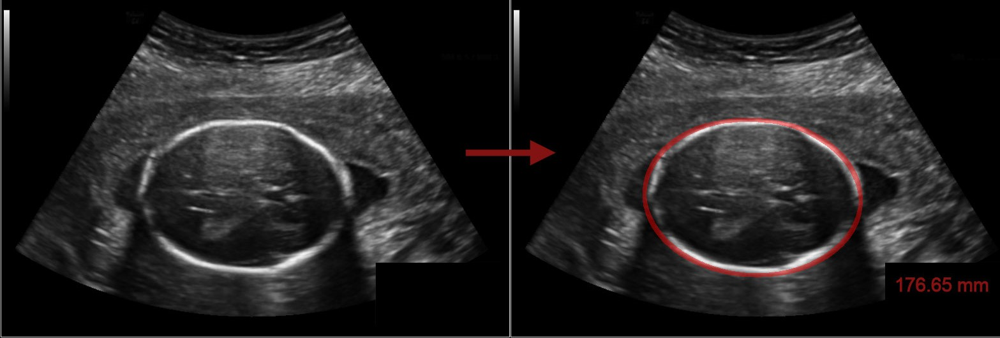
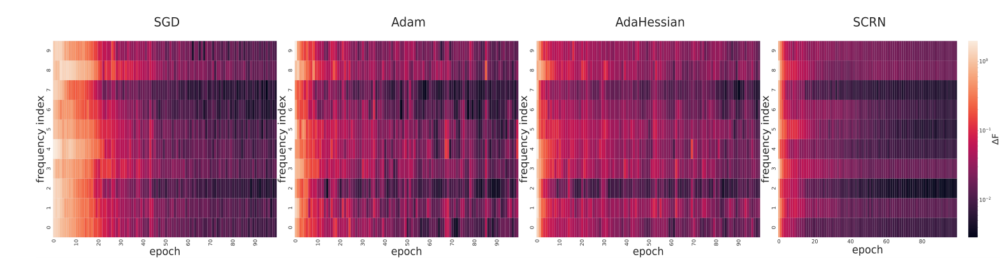
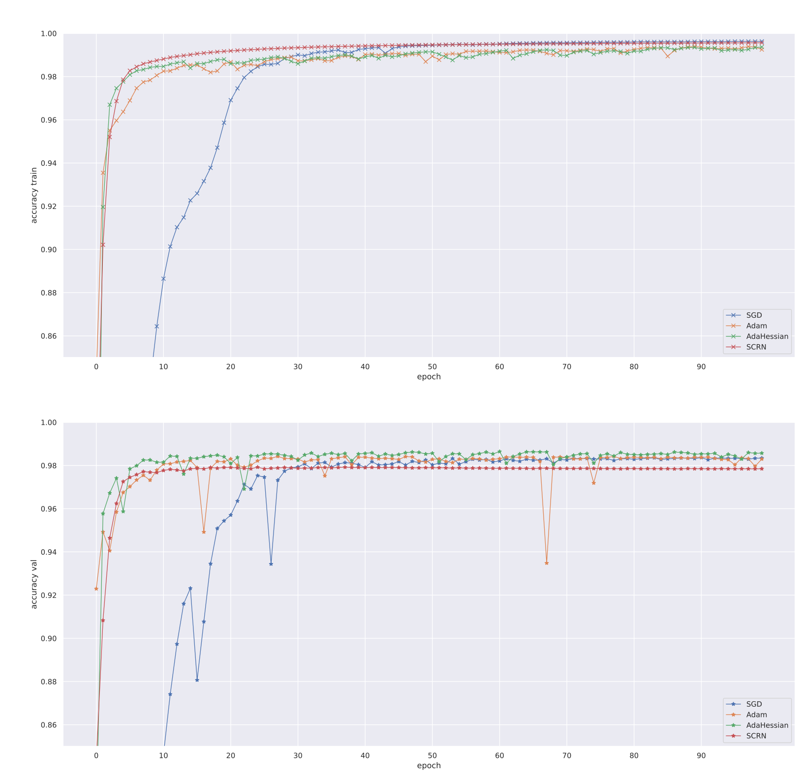
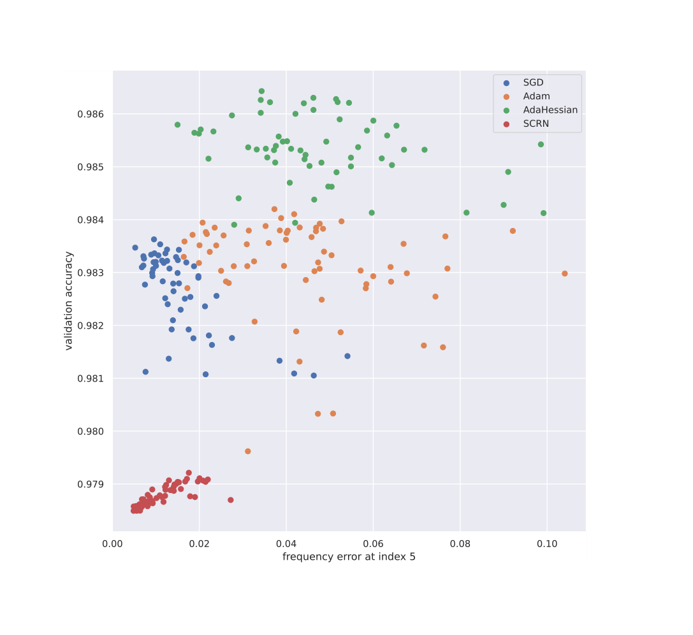

# **Frequency analysis of HC18 dataset segmentation by a DNN**

 

HC18 challenge [description](https://hc18.grand-challenge.org/) 

Dataset can be downloaded [here](https://zenodo.org/record/1327317#.YqxGS3ZBxPY)

---
Here we describe the code used to implement the **experiment III-C** of the report which corresponds to image segmentation.

**The code is divided into 4 `jupyter notebooks`:**

>  1.   Pre-processing HC18 Dataset
>  2.   Training a DNN for HC18 segmentation task
>  3.   Frequency analysis for HC18 segmentation task
>  4.   Results visualization for HC18 segmentation task


The 4 notebooks should be run in the above order. The notebook 2 takes several hours to achieve its run due to slow speed of neural network training.


<font size="2">* The reason of this structure is the important dataset size and slow processing speed. In order to save time, we had to save data and results at different steps and re-open it afterwards for further analysis. Moreover, the `.ipynb` files distinguish very different substeps of the experiments and we think the code is more understandable like this.

<font size="2">* We include all the functions except those comming from `pip` libraries, into the `.ipynb` files. 

---
  
  
### **Pre-processing HC18 Dataset**

**Description:** In this notebook, we provide the codes for:

**1.   Functions to pre-process images**

<details>
  <summary>Function headers</summary>
  
  ```python
!pip install SimpleITK

def resize_image(nump_image, orig_spacing, new_spacing, new_size):

  '''  
  This function re-samples an image to a new spacing and crops it to a newsize by using SimpleITK linear interpolation method. 

  nump_image: numpy array containing the image to process
  orig_spacing: original pixels size in mm
  new_spacing: spacing for re-sampling
  new_size: new_size to which crop the nump_image

  Return: a numpy array with the processed image

  '''

def format_masks(img):

  '''This function creates a mask from an image which only contains segmentation contours.

  img: the image as numpy array 

  return: a numpy array with the processed image
  '''
```
</details>

**2.   Running image pre-processing over HC18 dataset**

<details>
  <summary>Function headers</summary>
  
  ```python 
  # A notebook cell to loop over the HC18 images and apply the formatting functions.
  ```

</details>

**3.   Saving images to new folder**

<details>
  <summary>Function headers</summary>
  
  ```python 
  # A notebook cell to loop over the pre-processed HC18 images and save it in new folder.
 ```

</details>  
  
  
---
  
### **Training a DNN for HC18 segmentation task**

**Description:** In this notebook, we provide the codes for:

**1.   Opening data and preparing data for training (Functions)**


<details>
  <summary>Function headers</summary>
  
  ```python
def extract_files(path):
  ''' Function to load data from folder path.
      Performs basic pre-processing on images 
      (normalization, masks to float)

      path: folder where the training images are stored
      return: list, list (two lists containing 
      the images and masks respectively)
  '''

def load_data(trpath = 'train_folder', 
              vpath = 'val_folder'):
  
  ''' This function loads the validation and 
      training data from their respective 
      folders and fuse them to allow the 
      automatic change of train / val split
       depending on random shuffling   seed. 

      return: numpy array, numpy array 
      (two numpy arrays with the fused 
      images data and masks respectively)
  '''

def split_train_val(train_input_, SEED=0):

  '''This function simply split train_input_ 
  into 300 validation samples and 699 
  training samples after random shuffling with seed SEED. 

  Return: numpy array, numpy array, numpy array 
  (train images, train masks, val images, val masks resp.)
  '''

class MyDataset(TensorDataset):
  #This class formats the data for training in pytorch.


def get_dataloaders(train_input, train_output, val_input, val_output, BATCH_SIZE = 5):

  '''This function creates data loaders for training in pytorch. 
  It also extracts
  the weights for cross-entropy loss.
  train_input (samples x W x H): list of input train images
  train_output (samples x W x H): list of output train masks
  val_input (samples x W x H): list of input val images
  val_output (samples x W x H): list of output val masks

  return : torch dataloader, torch dataloader, numpy array
  (training loader, val loader, weights)
  '''

```
</details>


**2.   Model architecture (Class)**


<details>
  <summary> Function headers</summary>

  ```python
      class UNET(nn.Module):
          
      # Sandra Marcadent pytorch implementation of 2D Unet [1]

      # [1] @article{Ronneberger2015, 
      # author = {Olaf Ronneberger and Philipp Fischer and Thomas Brox}, 
      # month = {5}, 
      # title = {U-Net: Convolutional Networks for Biomedical Image # Segmentation},
      # url = {http://arxiv.org/abs/1505.04597},
      # year = {2015},
      #}
  ```
</details>

**3.   Training function**

<details>
  <summary>Function headers</summary>
  
  ```python
def train(model, device, train_dl, valid_dl, loss_fn, optimizer, epochs=100,
          lr_base=0.01, save=False, savepath='', mode=''):
  
    '''This function trains a DNN and saves the results for frequency analysis.
    model: torch.nn network
    device: gpu or cpu torch device
    train_dl: training dataloader
    valid_dl: validation dataloader
    loss_fn: loss function to optimize
    mode: Hessian or empty (default) mode

    return: torch.nn 
    (The trained neural network)
    '''

def get_outputs(y_hat, val=False):

  '''This function formats the DNN output for frequency analysis.
  y_hat: a mini batch of size (B x C x H x W)

  return: numpy array
  (formated y_hat)
  '''
```
</details>

  

**4.   Second-order optimizers (Class)**


<details>
  <summary>Function headers</summary>
  
  ```python
class AdaHessian(torch.optim.Optimizer):
    """
    Implements the AdaHessian algorithm from "ADAHESSIAN: An Adaptive Second OrderOptimizer for Machine Learning"
    Arguments:
        params (iterable) -- iterable of parameters to optimize or dicts defining parameter groups
        lr (float, optional) -- learning rate (default: 0.1)
        betas ((float, float), optional) -- coefficients used for computing running averages of gradient and the squared hessian trace (default: (0.9, 0.999))
        eps (float, optional) -- term added to the denominator to improve numerical stability (default: 1e-8)
        weight_decay (float, optional) -- weight decay (L2 penalty) (default: 0.0)
        hessian_power (float, optional) -- exponent of the hessian trace (default: 1.0)
        update_each (int, optional) -- compute the hessian trace approximation only after *this* number of steps (to save time) (default: 1)
        n_samples (int, optional) -- how many times to sample `z` for the approximation of the hessian trace (default: 1)

    Reference: https://github.com/amirgholami/adahessian

    """

class SCRNOptimizer(Optimizer):
```
</details>


**5.   Helpers to train with each optimizer and save**


<details>
  <summary>Function headers</summary>
  
  ```python
def train_Adam(device, train_dl, valid_dl, w,
                LR_BASE = 0.01, savepath='',
                SEED=0):
  
  '''Trains a unet model with Adam and weighted cross-entropy loss.
     Saves the results for frequency analysis in a newly created
    folder which corresponds to the optimization method. 

    device: gpu or cpu torch device
    train_dl: training dataloader
    valid_dl: validation dataloader
    w: weights for the cross-entropy loss
    LR_BASE: learning rate
    SEED: the seed used to initialize the model and split the dataset (only used for the savepath here)

    '''
```

The same function is replicated with the optimizer changing as well as the folder save path. Second-order methods take mode='Hessian' for the training.

</details>


**6.   Utilities to ensure reproductibility**

<details>
  <summary>Function headers</summary>
  
  ```python
def set_seed(seed):
    """Set the process-wide random seed.
    Args:
        seed (int): A positive integer
    """

def get_seed():
    """Get the process-wide random seed.
    Returns:
        int: The process-wide random seed
    """

def get_tf_seed_stream():
    """Get the pseudo-random number generator (PRNG) for TensorFlow ops.
    Returns:
        int: A seed generated by a PRNG with fixed global seed.
    """
```

</details>


**7.   Training and save loop over seeds and optimizers**

<details>
  <summary>Function headers</summary>
  
  ```python
# A notebook cell to loop over seeds and train each optimizer with the above functions.
```
</details>
  
---  
 ### **Frequency analysis for HC18 segmentation task**

**Description:** In this notebook, we provide the codes for:

**1.   PCA, non-uniform Fourier transform & frequency error computation functions**

<details>
  <summary>Function headers</summary>
  
  ```python
# !pip install nfft

def get_pca_coeffs(x):

  '''This function extracts the first PC of dataset X.
  X: Nsamples x Nfeatures

  return numpy array, numpy array
  (first PC of X, projection of X on PC)
  '''

def F_effect_nn(pca_out,y,x,x_sort,FGT):

    '''This function computes the frequency error of function y = x, where:

    y; Nsamples x Npixels: Unet output masks flattened 
    x; Nsamples: is the first projection of input images on first PC of input images
    x_sort: x values sorted in increasing order
    pca_out: is the first PC of output masks
    FGT: non-uniform Fourier coefficients of ground truch function proj(yGT,pca_out) = x.

    return: numpy array
    (Frequency error)
    '''

def analize_training_nn(path, tr_output, pca_out, x, x_sort, F_GT, do_FPrinciple = True):

  '''
  This function loops over training data files to compute the frequency analysis.
    path: the folder where to find the DNN training output masks per epoch as .npy
    pca_out: is the first PC of train output masks

    x; Nsamples: is the first projection of training input images on first PC of training input images
    x_sort: x values sorted in increasing order
    F_GT: non-uniform Fourier coefficients of ground truch function proj(yGT,pca_out) = x (training)

    return list, list, list 
    (epochs, accuracies, freq errors)
  '''

def analize_val(path, v_output):

  '''
    This function loops over validation data files to compute the val accuracy.
    path: the folder where to find the DNN val output masks per epoch as .npy
    tr_output: val ground truth output masks to compute the accuracy

    return: list, list
    (epochs, accuracies)
  '''
```
</details>


**2.   Opening reference data and data formatting functions**


<details>
  <summary>Function headers</summary>
  
  ```python
def format_tr_v(train_input, train_output, val_input, val_output):

  '''Prepares the training and validation datasets for frequency analysis, by flattening images.
  train_input (samples x W x H): list of input train images
  train_output (samples x W x H): list of output train masks
  val_input (samples x W x H): list of input val images
  val_output (samples x W x H): list of output val masks

  return: numpy array, numpy array, numpy array, numpy array
  (formatted train input, train output, val input, val output)
  '''
```
</details>


**3.   Storing and saving results functions**


<details>
  <summary>Function headers</summary>
  
  ```python
def store_values(tr_output, pca_out, x,  x_sort, F_GT,  v_output, paths):

    '''
    This function loops over training data files to compute the frequency analysis.

    paths: the list of folders (each folder / path = one method like SGD, Adam...) where to find the
    DNN training output masks per epoch as .npy

    tr_output: train ground truth output masks to compute the train accuracy
    pca_out: is the first PC of train output masks
    x; Nsamples: is the first projection of training input images on first PC of training input images
    x_sort: x values sorted in increasing order
    F_GT: non-uniform Fourier coefficients of ground truch function proj(yGT,pca_out) = x (training)
    v_output: val ground truth output masks to compute the val accuracy

    Return: 6 lists
    (paths, Freq errors, val accuracies, traina ccuracies, val epochs, train epochs)

    '''

def save_summaries(PATH, Ferr, ACC_V, ACC_T, EPS_V, EPS_T):

  '''Save the results stored in the input parameters as .npy.

    PATH: folder paths 
    Ferr: frequency errors per epoch
    ACC_V: validation accuracy for each method
    ACC_T: training accuracy for each method
    EPS_V: keep track of val epochs order
    EPS_T: keep track of train epochs order

  '''
```
</details>

**5.   Loop to execute the above functions for the various optimizers and seed**
<details>
  <summary>Function headers</summary>
  
  ```python
# Notebook cell to loop over the folders path with training results and run the frequency analysis and store it.
```
</details>

---
### **Results visualization for HC18 segmentation task**

**Description:** In this notebook, we provide the codes for:

**1.   The frequency heatmaps (figure 3 of the report)** 
  
 

<details>
  <summary>Function headers</summary>
  
  ```python

def format_frequency(freq_map, epoch_0=0,epoch_f=100,frec_index_0=0,freq_index_f=10):

    '''Function helper to select epochs range and frequency ranges

    freq_map: frequency errors to plot as a heatmap

    return: numpy array
    (freq errors at epochs and indexs selected)
    '''

def plot_Fmap(freq_map, ax, cbar=False, title=''):

  '''Plots the frequency errors over epochs as a heatmap with seaborn.

  freq_map: frequency errors to print
  ax: matplotlib axes
  '''

def plot_barplots(models_name, models_Ferr,
                  savepath=''):
  
  ''' Plots the heatmaps for all the optimization methods and save

  models_name: list with methods tags
  models_Ferr: list with frequency errors
  '''

```
</details>


**2.   The linear regression and regression weights table**


<details>
  <summary>Function headers</summary>
  
  ```python
def print_scores_table(NAME, ACC_V, ACC_T, Ferr, epoch_0=0,epoch_f=100):

  '''Computes the linear regression described in section III-C of the report. 
  NAME: method name, i.e SGD...
  Ferr: frequency errors per epoch for each method (average per seed)
  ACC_V: validation accuracy per epoch for each method (average per seed)
  ACC_T: training accuracy per epoch for each method (average per seed)

  '''
```
</details>


**3.   The accuracy vs epochs plots (figure 4 of the report)**
  
 
 


<details>
  <summary>Function headers</summary>
  
  ```python
def plot_accuracies(NAME, ACC_V, ACC_T, epoch_0=0,epoch_f=100):


    '''Plots the Appendix function 5 of the report. 
    NAME: method name, i.e SGD...
    Ferr: frequency errors per epoch for each method (average per seed)
    ACC_V: validation accuracy per epoch for each method (average per seed)
    index: the frequency index against which the accuracy is visualized 
    '''
```
</details>

**5.   The validation accuracy vs frequency error at index 5 (figure 5 of the report)**

 
  
<details>
  <summary>Function headers</summary>
  
```python

def plot_freq(NAME, ACC_V, Ferr, index, epoch_0=0,epoch_f=100):


  '''Plots the Appendix function 5 of the report. 
  NAME: method name, i.e SGD...
  Ferr: frequency errors per epoch for each method (average per seed)
  ACC_V: validation accuracy per epoch for each method (average per seed)
  index: the frequency index against which the accuracy is visualized 
  ''' 
```
</details>
 
  
 
